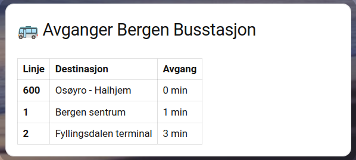
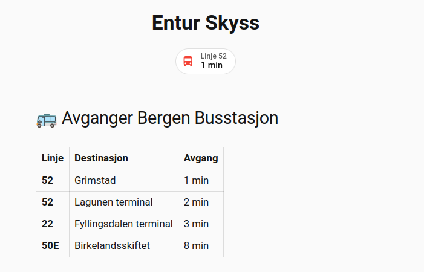
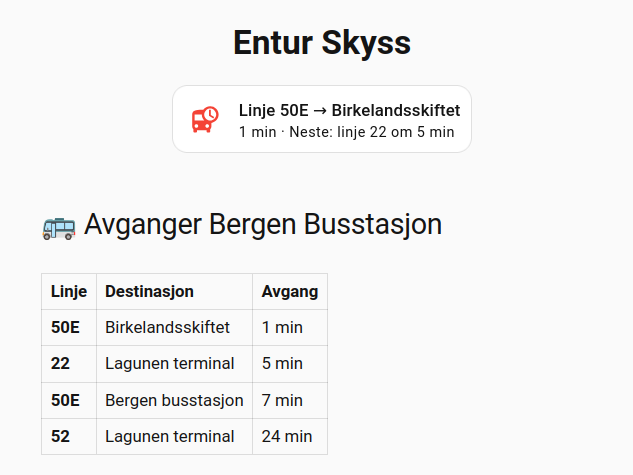

# ha-entur-skyss

> 🇳🇴 Norsk versjon / 🇬🇧 English below

---

## 🇳🇴 Norsk

Home Assistant-integrasjon for sanntidsavganger via [Entur](https://entur.no) sitt API. Utviklet og testet med [Skyss](https://www.skyss.no) i Bergen, men fungerer med alle norske stoppesteder i Entur-nettverket.

### Funksjoner

- Sanntidsavganger fra alle Entur-stoppesteder (NSR stopp-ID)
- Støtte for både hele stoppesteder (`NSR:StopPlace:`) og enkeltplattformer (`NSR:Quay:`, `SKY:Quay:`)
- Viser linjenummer, destinasjon og minutter til avgang
- Valgfritt antall avganger (1–20)
- Henter stoppestedsnavn automatisk fra Entur API
- Oppdateres hvert 45. sekund (anbefalt av Entur)
- Støtter flere stoppesteder — legg til så mange du vil

### Relaterte integrasjoner

#### Offisiell HA Entur-integrasjon
HA har en [innebygd Entur-integrasjon](https://www.home-assistant.io/integrations/entur_public_transport), men den er **Legacy** og krever `configuration.yaml`. Denne bruker moderne UI og er installerbar via HACS.

#### ha-entur_sx av DTekNO
Denne integrasjonen er **ikke** det samme som [ha-entur_sx av DTekNO](https://github.com/DTekNO/ha-entur_sx). De dekker ulike behov:

| | ha-entur_sx (DTekNO) | ha-entur-skyss (denne) |
|---|---|---|
| **Hva** | Varsler om innstillinger og forsinkelser | Neste avganger fra stoppested |
| **API** | SIRI-SX (Situation Exchange) | Journey Planner GraphQL |
| **Bruksområde** | "Er bussen innstilt?" | "Når går neste buss?" |

Alle tre fungerer utmerket sammen!

### Installasjon

#### HACS (anbefalt)
1. Åpne HACS i Home Assistant
2. Søk etter **Entur Skyss** under Integrasjoner
3. Installer og start Home Assistant på nytt

#### Manuell installasjon
1. Last ned dette repoet som ZIP
2. Pakk ut og kopier mappen `custom_components/ha_entur_skyss/` til `config/custom_components/` på din HA-instans
3. Start Home Assistant på nytt

### Konfigurasjon

1. Gå til **Innstillinger → Enheter og tjenester → Legg til integrasjon**
2. Søk etter **Entur Skyss**
3. Skriv inn stopp-ID for ønsket stoppested eller plattform

Gyldige ID-formater:

| Format | Eksempel | Beskrivelse |
|--------|---------|-------------|
| `NSR:StopPlace:XXXXX` | `NSR:StopPlace:62356` | Hele stoppet — alle avganger fra alle plattformer |
| `NSR:Quay:XXXXX` | `NSR:Quay:53118` | Én spesifikk plattform (nasjonal ID) |
| `SKY:Quay:XXXXXXXX` | `SKY:Quay:12010204` | Én spesifikk plattform (Skyss-ID) |

> **Tips:** Stopp med plattformer i flere retninger (f.eks. J, G og H) returnerer avganger fra alle retninger når du bruker `NSR:StopPlace:`. Bruk en quay-ID for å filtrere på én retning.

#### Finn din stopp-ID

**Hele stoppesteder** finner du på [entur.no](https://entur.no) eller [stoppested.entur.org](https://stoppested.entur.org). NSR-ID-en starter alltid med `NSR:StopPlace:`.

**Plattform-IDer (quay)** finner du ved å søke opp stoppestedet på [stoppested.entur.org](https://stoppested.entur.org), velge riktig plattform og kopiere quay-ID-en (starter med `NSR:Quay:` eller `SKY:Quay:`).

### Dashboard-kort

Bytt ut entitets-ID-en med din egen (finn den under **Utviklerverktøy → Tilstander**).

#### Markdown-tabell



```yaml
type: markdown
title: 🚌 Avganger
content: |
  
  | Linje | Destinasjon | Avgang |
  |-------|-------------|--------|
  
  | **{{ a.line }}** | {{ a.destination }} | {{ a.minutes }} min |
  
```

#### Mushroom badge

Kompakt badge som viser neste avgang. Fargen skifter automatisk: teal (> 5 min), oransje (2–5 min), rød (< 2 min).



Krever [Mushroom Cards](https://github.com/piitaya/lovelace-mushroom) (tilgjengelig i HACS).

```yaml
type: custom:mushroom-template-badge
icon: mdi:bus
color: >
  
  
    
    redorangeteal
  
label: >
  
  Linje {{ d[0].line }}
content: >
  
  {{ d[0].minutes }} min
```

#### Mushroom template-kort

Viser de neste to avgangene med fargeindikator.



Krever [Mushroom Cards](https://github.com/piitaya/lovelace-mushroom) (tilgjengelig i HACS).

```yaml
type: custom:mushroom-template-card
entity: sensor.entur_bergen_busstasjon
primary: >
  
  Linje {{ d[0].line }} → {{ d[0].destination }}
secondary: >
  
  
    {{ d[0].minutes }} min · Neste: linje {{ d[1].line }} om {{ d[1].minutes }} min
  
icon: mdi:bus-clock
icon_color: >
  
  
    
    redorangeteal
  
```

---

## 🇬🇧 English

Home Assistant integration for real-time departures via the [Entur](https://entur.no) API. Developed and tested with [Skyss](https://www.skyss.no) in Bergen, but works with any Norwegian stop in the Entur network.

### Features

- Real-time departures from any Entur stop (NSR stop ID)
- Supports both full stops (`NSR:StopPlace:`) and individual platforms (`NSR:Quay:`, `SKY:Quay:`)
- Shows line number, destination and minutes until departure
- Configurable number of departures (1–20)
- Automatically fetches stop name from the Entur API
- Updates every 45 seconds (as recommended by Entur)
- Supports multiple stops — add as many as you need

### Related integrations

#### Official HA Entur integration
HA has a [built-in Entur integration](https://www.home-assistant.io/integrations/entur_public_transport), but it is **Legacy** and requires `configuration.yaml`. This one uses a modern UI and is installable via HACS.

#### ha-entur_sx by DTekNO
This integration is **not** the same as [ha-entur_sx by DTekNO](https://github.com/DTekNO/ha-entur_sx). They serve different purposes:

| | ha-entur_sx (DTekNO) | ha-entur-skyss (this) |
|---|---|---|
| **What** | Alerts about cancellations and delays | Next departures from a stop |
| **API** | SIRI-SX (Situation Exchange) | Journey Planner GraphQL |
| **Use case** | "Is my bus cancelled?" | "When does the next bus leave?" |

All three work great together!

### Installation

#### HACS (recommended)
1. Open HACS in Home Assistant
2. Search for **Entur Skyss** under Integrations
3. Install and restart Home Assistant

#### Manual
1. Download this repository as a ZIP
2. Extract and copy the `custom_components/ha_entur_skyss/` folder to your HA `config/custom_components/` directory
3. Restart Home Assistant

### Configuration

1. Go to **Settings → Devices & Services → Add Integration**
2. Search for **Entur Skyss**
3. Enter the stop ID for your stop or platform

Valid ID formats:

| Format | Example | Description |
|--------|---------|-------------|
| `NSR:StopPlace:XXXXX` | `NSR:StopPlace:62356` | Full stop — all departures from all platforms |
| `NSR:Quay:XXXXX` | `NSR:Quay:53118` | One specific platform (national ID) |
| `SKY:Quay:XXXXXXXX` | `SKY:Quay:12010204` | One specific platform (Skyss ID) |

> **Tip:** Stops with platforms in multiple directions will return departures from all directions when using `NSR:StopPlace:`. Use a quay ID to filter for a single direction.

#### Finding your stop ID

**Full stops** can be found at [entur.no](https://entur.no) or [stoppested.entur.org](https://stoppested.entur.org). The NSR ID always starts with `NSR:StopPlace:`.

**Platform IDs (quay)** can be found by looking up the stop at [stoppested.entur.org](https://stoppested.entur.org), selecting the correct platform, and copying the quay ID (starts with `NSR:Quay:` or `SKY:Quay:`).

### Dashboard cards

Replace the entity ID with your own (find it under **Developer Tools → States**).

#### Markdown table card


```yaml
type: markdown
title: 🚌 Departures
content: |
  
  | Line | Destination | Departure |
  |------|-------------|-----------|
  
  | **{{ a.line }}** | {{ a.destination }} | {{ a.minutes }} min |
  
```

#### Mushroom badge

Compact badge showing the next departure. Color changes automatically: teal (> 5 min), orange (2–5 min), red (< 2 min).


Requires [Mushroom Cards](https://github.com/piitaya/lovelace-mushroom) (available in HACS).

```yaml
type: custom:mushroom-template-badge
icon: mdi:bus
color: >
  
  
    
    redorangeteal
  
label: >
  
  Linje {{ d[0].line }}
content: >
  
  {{ d[0].minutes }} min
```

#### Mushroom template card

Shows the next two departures with color indicator.


Requires [Mushroom Cards](https://github.com/piitaya/lovelace-mushroom) (available in HACS).

```yaml
type: custom:mushroom-template-card
entity: sensor.entur_bergen_busstasjon
primary: >
  
  Linje {{ d[0].line }} → {{ d[0].destination }}
secondary: >
  
  
    {{ d[0].minutes }} min · Neste: linje {{ d[1].line }} om {{ d[1].minutes }} min
  
icon: mdi:bus-clock
icon_color: >
  
  
    
    redorangeteal
  
```

---

## License

MIT License — see [LICENSE](LICENSE)
